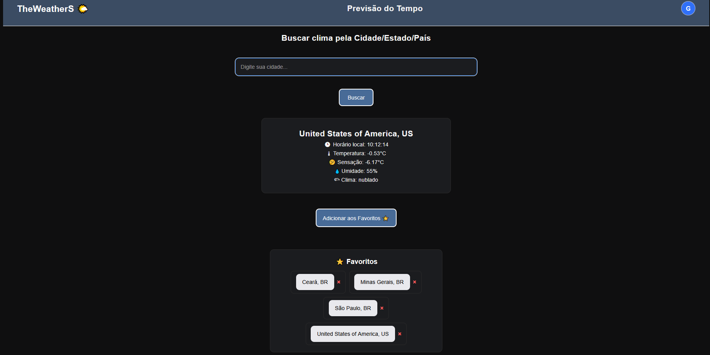
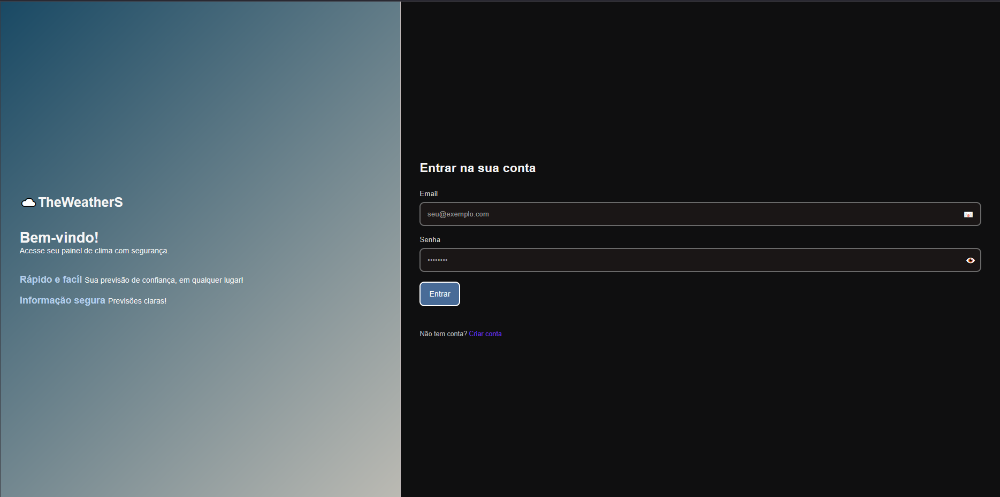
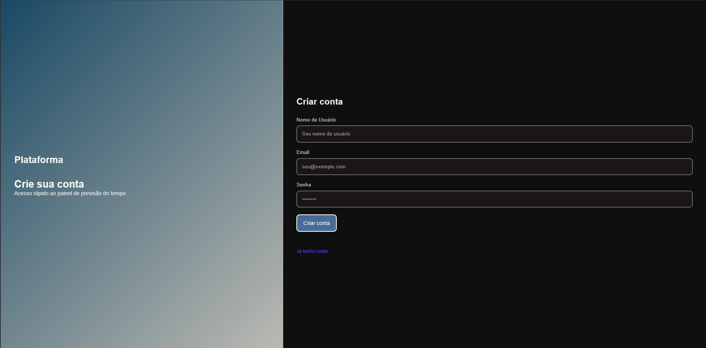

# weather-app
Aplicação de previsão do tempo com dados em tempo real  com login e cadastro para salvar favoritos| HTML, CSS, JavaScript
# ☁️ Weather App - Aplicação de Previsão do Tempo

Aplicação web de previsão do tempo com sistema de login e cadastro, integrada com API para consulta de temperatura e condições climáticas em tempo real.



## ✨ Funcionalidades

- 🔐 **Sistema de Login e Cadastro** - Autenticação de usuários
- 🌍 **Busca por Cidade** - Consulta clima de qualquer localidade
- 🌡️ **Temperatura em Tempo Real** - Dados atualizados via API
- ☀️ **Condições Climáticas** - Exibição de clima (ensolarado, nublado, chuvoso, etc.)
- 📊 **Informações Detalhadas** - Umidade, velocidade do vento, sensação térmica
- 💾 **Persistência de Dados** - Login mantido com LocalStorage/SessionStorage
- 📱 **Design Responsivo** - Funciona em desktop, tablet e mobile

## Tecnologias

- **HTML5** - Estrutura semântica
- **CSS3** - Estilização e animações
- **JavaScript** - Lógica e interatividade
- **API de Clima** - [Nome da API que você usou - ex: OpenWeatherMap, WeatherAPI]
- **LocalStorage** - Persistência de sessão do usuário

## 🔑 API Utilizada

Este projeto utiliza a **[OpenWeather]** para obter dados climáticos em tempo real.

Para rodar localmente, você precisará de uma chave de API:

1. Cadastre-se em: [https://old.openweathermap.org/]
2. Obtenha sua API Key
3. Substitua no código: `const API_KEY = 'SUA_CHAVE_AQUI'`

## 📂 Estrutura
```
weather-app/
├── index.html          # Página de login
├── cadastro.html       # Página de cadastro
├── dashboard.html        # Dashboard principal (clima)
├── style.css           # Estilos globais
├── auth.js            # Lógica de autenticação
├── weather.js          # Integração com API
 
```

## 🚀 Como usar

### Acessar Online

Acesse o site hospedado: [Ver projeto](https://gustavoribeirodeoliveira.github.io/weather-app)

### Passo a passo:

1. **Faça login ou cadastre-se**
   - Use qualquer email e senha para testar
   - Os dados ficam salvos no navegador

2. **Digite o nome de uma cidade**
   - Exemplo: "São Paulo", "Rio de Janeiro", "Tokyo"

3. **Veja a temperatura em tempo real!**
   - Temperatura atual
   - horario da região
   - Condições do clima
   - Umidade e vento
   - Sensação térmica

### Rodar Localmente (Para Desenvolvedores)

Se quiser rodar no seu computador:

1. Clone o repositório:
```bash
git clone https://github.com/GustavoRibeirodeoliveira/weather-app.git
```

2. Abra o arquivo `index.html` no navegador

3. **(Opcional)** Use um servidor local:
```bash
# Com Python
python -m http.server 8000

# Com Node.js
npx http-server
```

4. **Se usar API própria:** Substitua a chave no `weather.js`:
```javascript
const API_KEY = 'SUA_CHAVE_AQUI';
```
```

---

## **🎯 DIFERENÇA:**

**❌ ANTES (muito técnico):**
```
Clone o repositório
Configure API Key
Entre na pasta
Rode servidor local
```

**✅ AGORA (focado no usuário):**
```
1. Acesse o site
2. Faça login
3. Digite uma cidade
4. Veja a temperatura!
## 📸 Screenshots

### Tela de Login


### Dashboard do Clima


### Tela de Cadastro


## 🎯 Funcionalidades Técnicas

### Sistema de Autenticação
- Validação de campos (email, senha)
- Cadastro de novos usuários
- Login com verificação de credenciais
- Sessão persistente com LocalStorage

### Integração com API
```javascript
// Exemplo de chamada à API
async function getWeather(city) {
  const response = await fetch(
    `https://api.exemplo.com/weather?q=${city}&appid=${API_KEY}`
  );
  const data = await response.json();
  displayWeather(data);
}
```

### Tratamento de Erros
- Validação de cidade não encontrada
- Erro de conexão com API
- Campos obrigatórios vazios
- Credenciais inválidas

## 🔐 Segurança

⚠️ **Nota:** Este é um projeto educacional. Em produção:
- Use backend real para autenticação
- Nunca exponha API Keys no frontend
- Implemente criptografia de senhas
- Use HTTPS

## 🎨 Recursos Visuais

- Ícones animados de clima
- Transições suaves
- Gradientes dinâmicos baseados no clima
- Cards responsivos
- Design moderno e intuitivo

## 📝 Próximas Melhorias

- [ ] Previsão para 7 dias
- [ ] Histórico de buscas
- [ ] Gráficos de temperatura
- [ ] Múltiplos idiomas
- [ ] Tema claro/escuro
- [ ] Compartilhamento nas redes sociais
- [ ] Integração com geolocalização

## 💻 Desenvolvido por

**Gustavo Ribeiro**
- GitHub: [@GustavoRibeirodeoliveira](https://github.com/GustavoRibeirodeoliveira)
- LinkedIn: [Gustavo Ribeiro](https://linkedin.com/in/gustavo-ribeiro-de-oliveira-156632245)

## 📄 Licença

Este projeto está sob a licença MIT. Sinta-se livre para usar e modificar.

---

 
